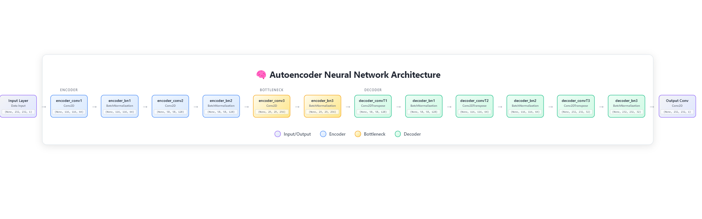

# Anomaly Detection and Localization


## Project Overview

This project leverages a **Long Short-Term Memory (LSTM) Autoencoder** to detect and localize anomalies in surveillance video data. The model flags anomalies based on reconstruction error thresholds by reconstructing normal sequences. It's ideal for tasks like identifying unusual activities in video footage.

---

## Features

- **LSTM Autoencoder**: Harnesses temporal patterns for anomaly detection.
- **Localization: This project is able to localize the anomaly area of video.  
- **Preprocessing Pipeline**: Streamlines data normalization and sequence preparation.
- **Visualization**: Includes loss graphs for performance tracking.
- **Customizable Threshold**: Tweak anomaly sensitivity via reconstruction error thresholds.
- **Exportable Model**: Save trained models for future inference.

---

## Model Architecture
This is a Convolutional Autoencoder that compresses 232×232 input images through an encoder (Conv2D + BatchNorm layers) down to a 29×29×256 bottleneck representation, then reconstructs the original image size through a symmetric decoder using transposed convolutions. The model learns to encode standard patterns into a compact latent space and decode them back, creating a reconstruction that should closely match the input for normal data.




## Installation

1. Clone this repository:
   ```bash
   git clone https://github.com/Mehedi-Bin-Hafiz/Surveillance-Anomaly-Detection-and-Localization-by-Autoencoder.git

2. Navigate to the project directory:

```bash
cd Surveillance-Anomaly-Detection-and-Localization-by-Autoencoder

```

3. Install dependencies:

```bash
pip install -r requirements.txt

```

## Dataset is taken from

```bash
Anomaly Detection in Crowded Scenes.
V. Mahadevan, W. Li, V. Bhalodia and N. Vasconcelos.
In Proc. IEEE Conference on Computer Vision and Pattern Recognition (CVPR), 
San Francisco, CA, 2010
```